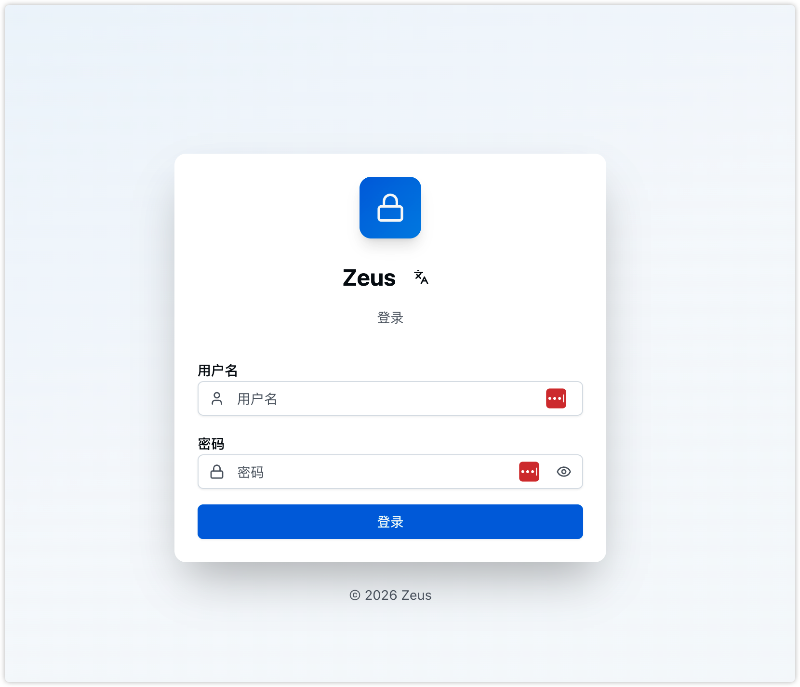
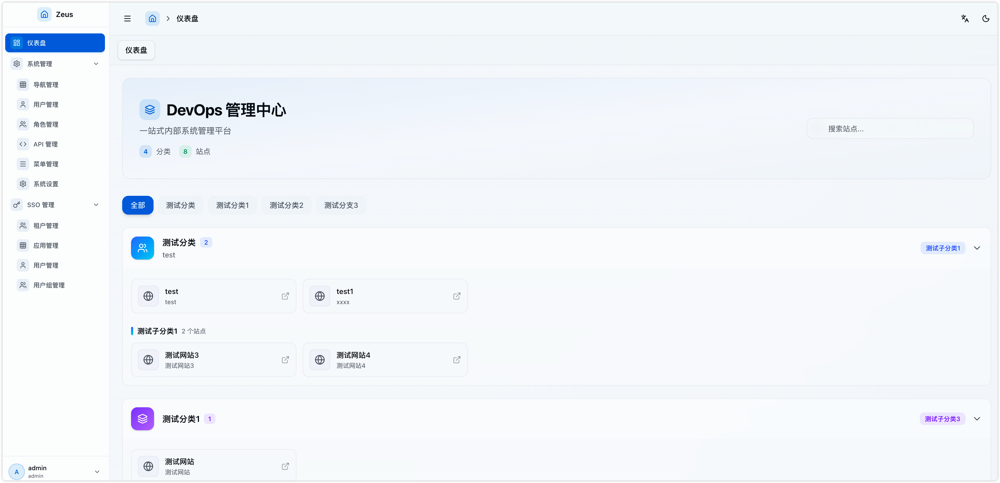

# Zeus 运维管理中心

Zeus 是一个企业级运维管理中心，提供统一的导航服务、SSO 单点认证服务和工单管理系统。基于 Go (Gin) + React (Vite) + Tailwind CSS 构建，采用 Monorepo 结构，实现 RBAC 权限管理和 JWT/OIDC 认证。

## 核心功能

- **运维管理中心**：统一管理企业内各类运维工具导航和单点登录系统
- **导航服务**：提供统一的应用导航入口，集中管理应用
- **SSO 单点认证服务**：作为身份提供者（Identity Provider），为其他应用提供统一的认证服务
- **工单管理系统**：灵活的工单流程管理，支持自定义表单和审批流程

## 界面预览

### 登录页面


### 导航页面


## 技术栈

### 后端
- **Go 1.24+** - 后端开发语言
- **Gin** - HTTP Web 框架
- **GORM** - ORM 框架（支持自定义日志和慢查询检测）
- **MySQL** - 关系型数据库
- **JWT** - 身份认证
- **OIDC** - OpenID Connect 认证
- **Casbin** - RBAC 权限控制
- **Zap** - 结构化日志
- **Statik** - 静态文件嵌入（前端打包到后端）
- **Prometheus** - 性能监控指标

### 前端
- **React 19+** - UI 框架
- **Vite** - 构建工具
- **TypeScript** - 类型系统
- **Radix UI** - 无障碍 UI 组件库
- **Tailwind CSS** - 实用优先的 CSS 框架
- **React Router** - 路由管理
- **Axios** - HTTP 客户端
- **Zustand** - 状态管理
- **Sonner** - Toast 通知
- **i18next** - 国际化支持（中英文切换）

## 功能特性

### 🎯 导航服务
- 统一应用导航入口
- 应用分类管理
- 应用图标和描述
- 快速访问常用应用
- 应用搜索功能

### 🔐 SSO 单点认证服务
作为身份提供者（Identity Provider）支持：

**OIDC Provider**
- 完整的 OpenID Connect 实现
- 支持 Authorization Code Flow
- 支持 Client Credentials Flow
- 支持 Refresh Token
- 标准 OIDC 端点（Discovery、JWKS、Token、UserInfo 等）

**LDAP Server**
- 内置 LDAP 服务器
- 支持 Bind 认证和 Search 查询
- 兼容主流 LDAP 客户端（GitLab、Jenkins、Nexus 等）

**多租户管理**
- 租户隔离
- SSO 用户/用户组管理
- OIDC 应用管理

### 📋 工单管理系统 `开发中`
> ⚠️ 工单功能目前处于开发阶段，基本功能已完成，部分高级功能持续完善中。

完整的工单生命周期管理：

**工单类型管理**
- 自定义工单类型
- 类型启用/禁用控制
- 关联表单模板和审批流程

**表单模板**
- 可视化表单设计器
- 支持多种字段类型（文本、数字、日期、下拉选择等）
- 字段校验规则配置
- 模板复用

**审批流程**
- 可视化流程设计器
- 多级审批节点配置
- 支持多种审批人类型：
  - 指定角色审批
  - 指定用户审批
  - 表单字段动态指定
- 条件分支（基于表单字段值）
- 流程版本管理

**工单操作**
- 创建工单（支持快捷模板）
- 工单提交与审批
- 审批通过/拒绝
- 工单完成/取消
- 评论功能
- 附件上传/下载
- 审批记录追溯

**工单视图**
- 我的工单
- 待我审批
- 我处理的工单
- 抄送我的工单

**统计报表**
- 工单状态分布
- 工单优先级分布
- 按类型统计

### 👥 用户与权限管理
**用户管理**
- 用户列表（分页、搜索）
- 用户创建/编辑/删除
- 用户角色分配
- 用户状态管理
- 密码修改

**角色管理**
- 角色列表（分页、搜索）
- 角色创建/编辑/删除
- 角色策略分配（基于 Casbin RBAC）
- 角色菜单分配
- 多角色支持

**菜单管理**
- 菜单树形结构
- 动态菜单生成（根据用户权限）
- 菜单图标选择器
- 菜单排序

### ⚙️ 系统配置
- OIDC 配置管理
- 邮件服务配置
- 邮件测试功能

### 📊 性能监控
- Prometheus 格式指标
- 请求耗时统计
- 请求大小统计
- 错误计数统计

### 🌐 国际化
- 中英文切换
- 语言持久化存储
- 界面文本完整国际化

### 🎨 用户体验
- 响应式设计
- 现代化 UI 设计
- 明暗主题切换
- 多标签页管理
- 角色切换（支持多角色用户）

## 项目结构

```
zeus/
├── backend/                 # Go 后端服务
│   ├── cmd/
│   │   └── server/         # 应用入口
│   ├── internal/
│   │   ├── config/         # 配置管理
│   │   ├── model/          # 数据模型
│   │   ├── service/        # 业务逻辑层
│   │   ├── handler/        # HTTP 处理器
│   │   ├── middleware/     # 中间件
│   │   ├── casbin/         # RBAC 权限控制
│   │   └── router/         # 路由配置
│   ├── pkg/                # 公共包
│   │   ├── jwt/            # JWT 工具
│   │   ├── logger/         # 日志工具
│   │   ├── response/       # 响应封装
│   │   ├── storage/        # 文件存储（本地/OSS/S3）
│   │   ├── notify/         # 通知服务（钉钉/企业微信）
│   │   └── email/          # 邮件服务
│   ├── migrations/         # 数据库迁移和种子数据
│   ├── statik/             # 静态文件嵌入（自动生成）
│   └── config.yaml.example # 配置示例
├── frontend/                # React 前端应用
│   ├── src/
│   │   ├── api/            # API 请求封装
│   │   ├── components/     # 公共组件
│   │   │   ├── ui-tw/     # Tailwind UI 组件
│   │   │   └── ticket/    # 工单相关组件
│   │   ├── hooks/          # 自定义 Hooks
│   │   ├── layouts/        # 布局组件
│   │   ├── pages/          # 页面组件
│   │   ├── router/         # 路由配置
│   │   ├── store/          # 状态管理
│   │   ├── utils/          # 工具函数
│   │   └── i18n/           # 国际化配置
│   └── package.json
└── README.md
```

## 快速开始

### 环境要求

- Go 1.24+
- Node.js 18+
- MySQL 5.7+

### 后端启动

1. **配置数据库**

   ```bash
   cd backend
   cp config.yaml.example config.yaml
   # 编辑 config.yaml，配置数据库连接信息
   ```

2. **初始化数据库**

   ```sql
   CREATE DATABASE zeus CHARACTER SET utf8mb4 COLLATE utf8mb4_unicode_ci;
   ```

3. **启动服务**

   ```bash
   cd backend
   go run cmd/server/main.go
   # 首次运行会自动创建表结构和初始化数据
   ```

   默认管理员账号：
   - 用户名: `admin`
   - 密码: `admin123`

   服务将在 `http://localhost:8080` 启动

### 前端启动

1. **安装依赖**

   ```bash
   cd frontend
   yarn install
   ```

2. **启动开发服务器**

   ```bash
   yarn dev
   ```

   前端将在 `http://localhost:3000` 启动

### 构建部署

```bash
# 完整构建（前端 + 嵌入到后端）
make build

# 或分步构建
make build-frontend  # 构建前端
make build-backend   # 构建后端

# 运行
./backend/bin/server
```

## 配置说明

### 数据库配置

```yaml
database:
  host: localhost
  port: 3306
  user: root
  password: password
  dbname: zeus
  charset: utf8mb4
  max_open_conns: 100
  max_idle_conns: 10
  log_level: warn      # GORM 日志级别
  slow_threshold: 200  # 慢查询阈值（毫秒）
```

### SSO 配置

#### OIDC Provider

```yaml
sso:
  enabled: true
  issuer: "https://sso.example.com"
  oidc:
    access_token_ttl: 3600
    refresh_token_ttl: 604800
    code_ttl: 600
```

#### LDAP Server

```yaml
sso:
  ldap:
    enabled: true
    port: 389
    base_dn: "dc=zeus,dc=local"
    admin_dn: "cn=admin,dc=zeus,dc=local"
    admin_password: "your-admin-password"
```

### 文件存储配置

```yaml
storage:
  type: local  # local, oss, s3
  local:
    path: ./uploads
  oss:
    endpoint: oss-cn-hangzhou.aliyuncs.com
    access_key_id: your-access-key
    access_key_secret: your-secret
    bucket: your-bucket
  s3:
    endpoint: s3.amazonaws.com
    region: us-east-1
    access_key_id: your-access-key
    secret_access_key: your-secret
    bucket: your-bucket
```

## SSO 客户端配置示例

### GitLab (OIDC)

```yaml
gitlab_rails['omniauth_providers'] = [
  {
    name: "openid_connect",
    label: "Zeus SSO",
    args: {
      scope: ["openid", "profile", "email", "groups"],
      issuer: "https://sso.example.com",
      discovery: true,
      client_options: {
        identifier: "your-client-id",
        secret: "your-client-secret",
        redirect_uri: "https://gitlab.example.com/users/auth/openid_connect/callback"
      }
    }
  }
]
```

### Grafana (OIDC)

```ini
[auth.generic_oauth]
enabled = true
name = Zeus SSO
client_id = your-client-id
client_secret = your-client-secret
scopes = openid profile email groups
auth_url = https://sso.example.com/oauth/authorize
token_url = https://sso.example.com/oauth/token
api_url = https://sso.example.com/oauth/userinfo
```

### GitLab (LDAP)

```yaml
gitlab_rails['ldap_servers'] = {
  'main' => {
    'label' => 'Zeus LDAP',
    'host' => 'sso.example.com',
    'port' => 389,
    'uid' => 'uid',
    'bind_dn' => 'cn=admin,dc=zeus,dc=local',
    'password' => 'admin-password',
    'base' => 'ou=users,o=tenant_name,dc=zeus,dc=local'
  }
}
```

## 注意事项

### 生产环境
- 修改 JWT Secret
- 设置 `server.mode` 为 `release`
- 配置数据库日志级别为 `warn` 或 `error`
- 配置日志输出到文件

### 安全
- 密码使用 bcrypt 加密存储
- 敏感配置使用环境变量
- 定期备份数据库

### 性能
- 根据实际情况调整数据库连接池大小
- 设置合适的慢查询阈值
- 生产环境建议关闭 GORM 的 info 级别日志

## 许可证

本项目采用 [MIT License](LICENSE) 开源协议。

Copyright (c) 2024 Zeus
